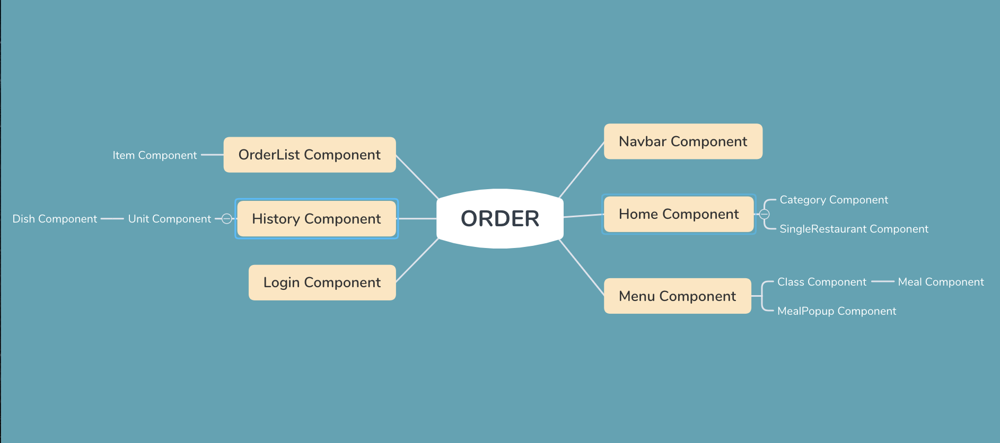
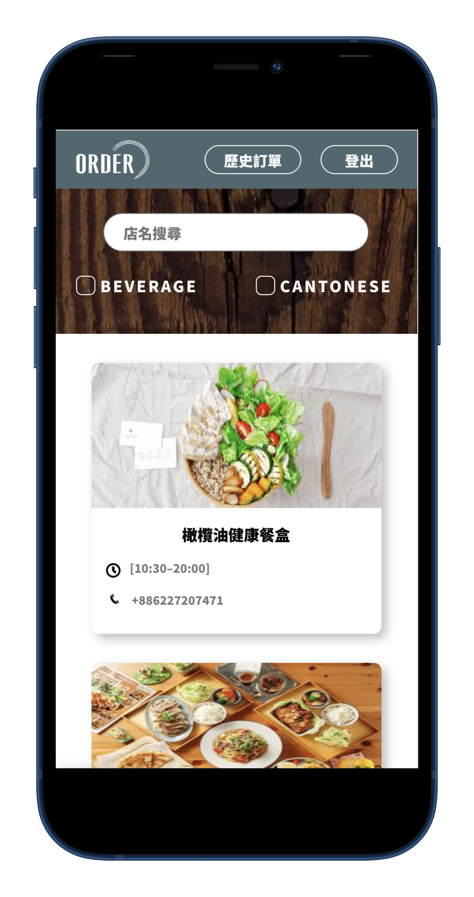

# ORDER

### A food exploring system, which helps user explore surrounded restaurants and start group-order event.

### Demo Link => https://order-7cbbf.web.app/

#### User: test@gmail.com Password: 000000

#### Technologies

-  Front-End Development
   -  HTML
   -  CSS
   -  JavaScript(ES6)
-  Framework & Library
   -  React
   -  React Router
   -  Facebook SDK
-  User Interface
   -  RWD
   -  CSS Module
   -  SCSS
-  Cloud Service
   -  Firebase Firestore
   -  Firebase Authentication
   -  Firebase Hosting
-  Tools for Development
   -  ESLint / Prettier
   -  Sourcetree

#### Core Components Structure

#### Demo

-  Add order to order lists.

#### RWD Demo

#### Plan for Next Version

-  Add comment feature
-  Add ranting feature
-  Protect private route
-  Refactor website with Redux

#### Contact

E-mail: qqq987410@gmail.com
